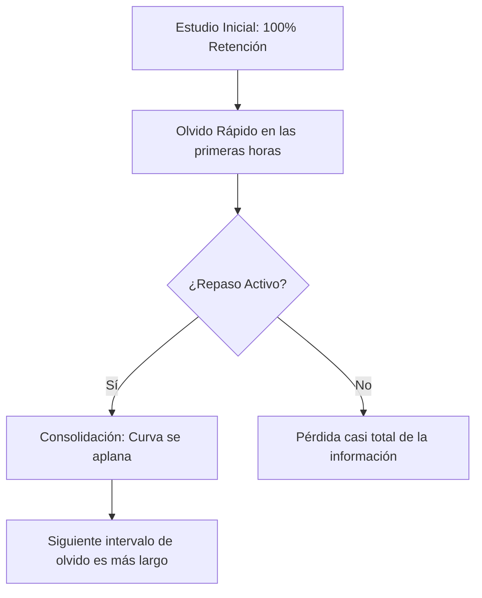

# Algoritmo de Repetición Espaciada (SM-2) y Snooze Inteligente en Threshold

Este documento detalla el funcionamiento científico, la arquitectura técnica y los principios pedagógicos que rigen el sistema de alertas de repaso y aplazamiento (*snooze*) inteligente en la aplicación **Threshold**.

---

## 1. Fundamentos Científicos: La Curva del Olvido
La repetición espaciada se basa en las investigaciones del psicólogo **Hermann Ebbinghaus** sobre la memoria humana. Ebbinghaus descubrió que los humanos olvidamos la información nueva a un ritmo exponencial (la *Curva del Olvido*), a menos que esa información sea reforzada activamente.

Cada vez que se repasa un concepto justo antes de olvidarlo, la tasa de olvido se ralentiza, alargando el tiempo en el que la información permanece retenida.



---

## 2. El Algoritmo SM-2 (SuperMemo-2)
El motor de repaso de Threshold utiliza una variante optimizada del clásico algoritmo **SM-2**, el estándar dorado en aplicaciones de aprendizaje (como Anki). 

Este algoritmo calcula de forma personalizada el momento óptimo de revisión para cada tarjeta de estudio mediante tres variables clave:

1. **Repetitions ($n$):** El número de veces consecutivas que la tarjeta se ha respondido correctamente.
2. **Ease Factor ($EF$):** El factor de facilidad que representa qué tan "difícil" es la tarjeta para el usuario. Comienza por defecto en `2.50`.
3. **Interval ($I$):** El espacio de tiempo (en días) antes de la siguiente revisión.

### Cálculo de Intervalos
El intervalo para la siguiente repetición se calcula matemáticamente de la siguiente manera:

* Para la **primera** respuesta correcta: 
  $$I(1) = 1 \text{ día}$$
* Para la **segunda** respuesta correcta: 
  $$I(2) = 6 \text{ días}$$
* Para la **tercera o posterior** ($n > 2$): 
  $$I(n) = I(n-1) \times EF$$

### Actualización del Factor de Facilidad ($EF$)
Cada vez que el usuario responde una tarjeta, introduce una calificación de calidad de respuesta ($q$) de 0 a 5:
* **5:** Respuesta perfecta, sin vacilación.
* **4:** Respuesta correcta tras una leve duda.
* **3:** Respuesta correcta con dificultad seria.
* **2:** Respuesta incorrecta, pero se recuerda al ver la solución.
* **1:** Respuesta incorrecta, pero la solución resulta familiar.
* **0:** Olvido total del concepto.

El factor de facilidad se actualiza mediante la fórmula:
$$EF' = EF + (0.1 - (5 - q) \times (0.08 + (5 - q) \times 0.02))$$

> [!NOTE]
> Si el usuario responde incorrectamente ($q < 3$), las repeticiones consecutivas se reinician a 0 ($n = 0$) y el intervalo vuelve a ser de 1 día, pero el Factor de Facilidad ($EF$) no se reinicia a su valor original de `2.5`, permitiendo que el algoritmo recuerde que esta tarjeta es inherentemente más compleja y requiera revisiones más frecuentes a largo plazo.

---

## 3. Snooze Inteligente y Aplazamiento Pedagógico
En ocasiones, los usuarios no pueden realizar sus repasos pendientes en el momento preciso de la alerta. In lugar de simplemente posponer la notificación al azar (lo cual induce fatiga de alertas y rompe la consistencia), Threshold implementa un sistema de **Snooze Inteligente** parametrizado pedagógicamente.

Definido en el hook `useDueCardSnooze.ts`, el sistema ofrece cuatro intervalos estratégicos:

| Opción | Duración (Minutos) | Enfoque Pedagógico | Justificación Científica |
| :--- | :--- | :--- | :--- |
| **En 30 minutos** | 30 min | *Consolidación Corto Plazo* | Excelente para mantener el *momentum* y repasar dentro de la misma sesión de estudio o al finalizar un bloque Pomodoro. |
| **En 4 horas** | 240 min | *Refuerzo Pre-Olvido* | Intervalo ideal en la Curva de Ebbinghaus para reactivar el aprendizaje antes de que empiece la caída libre de retención del día. |
| **Mañana** | 1440 min | *Consolidación del Sueño* | El sueño consolida el aprendizaje mediante la transferencia del hipocampo al neocórtex. La revisión al día siguiente sella esta memoria. |
| **En 3 días** | 4320 min | *Fase Crítica de Retención* | Punto límite en el que la retención promedio cae al 70%. Obliga a un esfuerzo de **Recuerdo Activo** (*Active Recall*) de alta eficiencia. |

---

## 4. Arquitectura Técnica en Threshold

### A. Persistencia con AsyncStorage
Para evitar que un cierre inesperado del app o la falta de conexión a internet reinicie el estado de aplazamiento, los datos de snooze se graban localmente usando la clave `@threshold_snoozed_cards`:

```typescript
interface SnoozedCard {
  id: string;      // ID único de la tarjeta o del grupo de alertas
  snoozedAt: number; // Timestamp en ms del momento del snooze
  resumeAt: number;  // Timestamp en ms en el que expira el snooze
}
```

### B. Reactividad en el Dashboard
El dashboard principal (`index.tsx`) y los componentes de visualización (`DashboardWidgets.tsx`) leen dinámicamente este almacenamiento local a través de `useDueCardSnooze`:

1. Al montar el componente, se filtran automáticamente y eliminan del storage los snoozes que ya expiraron (`resumeAt <= Date.now()`).
2. Se expone un estado reactivo de las tarjetas aplazadas que condiciona la renderización de la tarjeta de alertas en el Dashboard principal.
3. Si el usuario selecciona una opción del `SnoozeModal`, el dashboard activa un re-renderizado inmediato y oculta la alerta limpiamente sin interferir con la navegación del usuario.

> [!TIP]
> Este enfoque desacoplado asegura una experiencia libre de estrés cognitivo para el estudiante, permitiéndole ser dueño de su agenda de estudio sin interrumpir el ritmo natural del algoritmo de repetición espaciada global.
