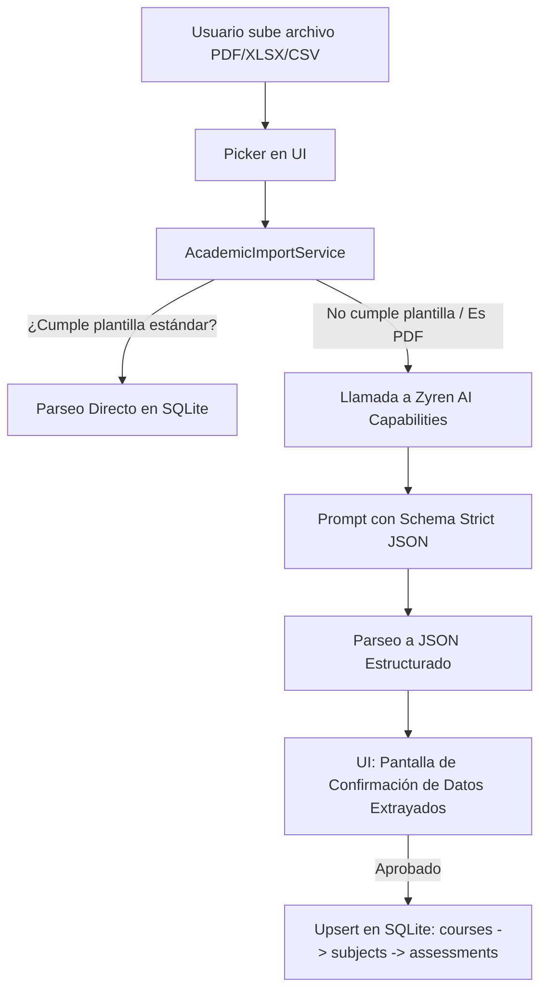

# Plan de Mejoras Futuras: Academic Import Asistido por IA

Este documento describe la visión a largo plazo para la funcionalidad de **Academic Import** en Threshold, extendiendo la importación de plantillas estándar de CSV a un modelo tolerante a fallos y basado en IA (PDF/LMS/CSV no estructurado).

## 1. Visión General
El objetivo final es eliminar la necesidad de que el usuario formatee manualmente sus registros académicos en una plantilla CSV estricta. En su lugar, el sistema aceptará formatos arbitrarios generados por plataformas universitarias comunes (Canvas, Blackboard, Moodle, banners universitarios en PDF) y mapeará los datos a la estructura interna de SQLite de Threshold.

## 2. Flujo Arquitectónico Propuesto



## 3. Especificación del Payload de la IA
El modelo de lenguaje del backend recibirá el texto extraído (mediante OCR o parser directo de PDF/Excel) y deberá mapearlo a la siguiente estructura JSON inmutable:

```json
{
  "courses": [
    {
      "name": "Primer Semestre 2026",
      "platform": "Canvas",
      "subjects": [
        {
          "name": "Cálculo Diferencial",
          "credits": 4.0,
          "assessments": [
            {
              "name": "Parcial 1",
              "weight": 25.0,
              "score": 4.2,
              "out_of": 5.0,
              "date": "2026-03-15"
            }
          ]
        }
      ]
    }
  ]
}
```

## 4. Mejoras Estructurales para Versión 2 (Futuro Trabajo)

### A. Filas Parciales por Herencia (Sparse Row Parsing)
Para evitar la repetición del nombre de Curso y Materia en cada fila del CSV, la v2 permitirá celdas vacías que "heredan" el último valor no vacío procesado:

```csv
Curso,Materia,Creditos,Evaluacion,Peso(%),Nota,NotaMaximo
2026-1,Calculo Diferencial,4,Parcial 1,30,4.5,5.0
,,Parcial 2,30,3.8,5.0
,,Final,40,4.7,5.0
,Física Mecánica,4,Lab 1,20,5.0,5.0
,,Final,80,4.2,5.0
```
- **Lógica de Parseo:** Si `Curso` o `Materia` están vacíos en una fila, el parser usará automáticamente el último `Course` o `Subject` no vacío procesado en las filas superiores.

### B. Integración Multi-plataforma (LMS)
Conexión directa vía APIs o tokens temporales con Canvas, Blackboard o Moodle para sincronizar las notas sin necesidad de exportación/importación manual de archivos.

## 5. Desafíos a Considerar
- **Tasas de conversión y precisión:** Al mapear notas académicas oficiales, una discrepancia del 1% en pesos o puntajes altera el GPA global. La pantalla de confirmación previa al guardado debe ser interactiva y permitir editar los campos erróneos detectados por la IA.
- **Rendimiento:** El proceso de OCR + Procesamiento de LLM puede demorar entre 5 a 15 segundos. Debe implementarse como una operación que informe progreso en tiempo real.
