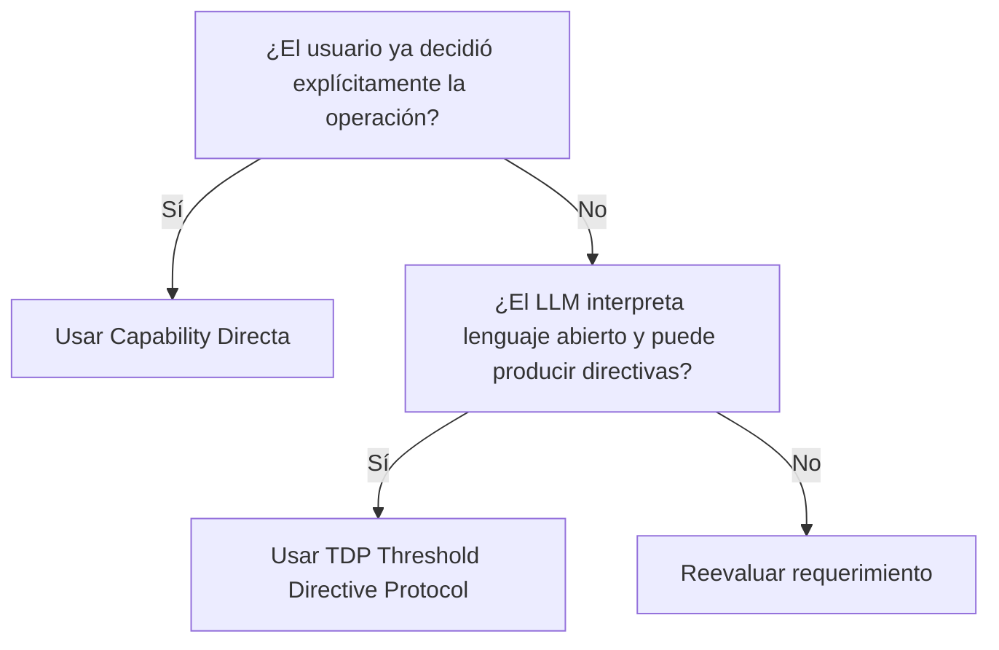

# Árbol de Decisión de Arquitectura AI (v2.0)

Este documento define la heurística oficial para decidir cómo integrar modelos de lenguaje (LLMs) en Threshold. Su propósito es evitar que el protocolo de directivas (TDP) se utilice como una abstracción universal donde no aporta valor, manteniendo claros los límites entre la intención determinística del usuario y la respuesta abierta del modelo.

## El Árbol de Decisión

Antes de implementar un nuevo flujo basado en IA, hazte la siguiente pregunta:

**¿El usuario ya decidió la operación (caso de uso) antes de invocar al LLM?**

---

## 1. Vía Determinística (Capability Directa)

### ¿Cuándo usarla?
Cuando el usuario interactúa con la UI de forma explícita para solicitar un artefacto o proceso concreto (ej. un botón que dice "Generar Flashcards" o "Resumir Documento").
En este escenario, **el sistema ya conoce la intención**, y el LLM solo actúa como motor de generación de contenido.

### Flujo Arquitectónico
`UI -> Capability -> Engine -> Model`
*(La UI delega la persistencia a un Domain Service o un Repository)*

### Ejemplos Reales en Threshold
- **Zyren Ingestion Modal (Hub de Materias):** El usuario pulsa "Generar tarjetas de esta clase". La UI delega en `FlashcardDomainService` y la `FlashcardCapability`.
- **OCR:** Se sube una imagen y se extrae texto. El usuario ya eligió "Escanear Documento". Usa `OCRCapability`.
- **Summaries:** Resumir el contexto de un Subject o un Documento. Usa una Capability directamente.
- **Importación de PDFs:** Híbrido, paso de extracción explícito.

---

## 2. Vía Abierta (Threshold Directive Protocol - TDP)

### ¿Cuándo usarlo?
Cuando el modelo actúa como un agente interactivo (como Zyren en una conversación) que recibe intenciones abiertas en lenguaje natural ("Ayúdame a estudiar esto", "Hazme un Quiz", "No entiendo este concepto") y **el modelo debe decidir qué herramienta usar** para satisfacer la solicitud.

### Flujo Arquitectónico
`UI -> ChatCapability -> AIOrchestrator -> Provider -> ResponseInterpreter (TDP) -> AIInteractionCoordinator -> DirectiveHandlerRegistry -> Handler -> Capability`

### Ejemplos Reales en Threshold
- **Chat Conversacional (Zyren):** El usuario pide aclaraciones o pide ayuda. El modelo puede simplemente responder o inyectar una directiva `create_deck`.
- **Generación Contextual Activa:** Si el modelo dice "He notado que te equivocas en estos conceptos, ¿quieres que te haga un mazo de refuerzo?". La acción surge de la interpretación del LLM.

## Reglas Asociadas
1. **Modelos no tienen efectos secundarios:** Ningún `Provider` o `Controller` del backend ejecuta lógica de dominio. Solo devuelven la estructura `AIResponse` con directivas (TDP).
2. **Handlers y Coordinators ejecutan:** La responsabilidad de leer la directiva e invocar la capa de dominio recae exclusivamente en el `AIInteractionCoordinator` (vía `DirectiveHandlerRegistry`).
3. **Persistencia Unificada:** Sea cual sea la vía (TDP o Capability Directa), la creación de agregados complejos (ej. Mazos de Flashcards) debe converger en un mismo punto del dominio (ej. `FlashcardDomainService`). La UI jamás debe generar identificadores ni invocar Repositories directamente.
