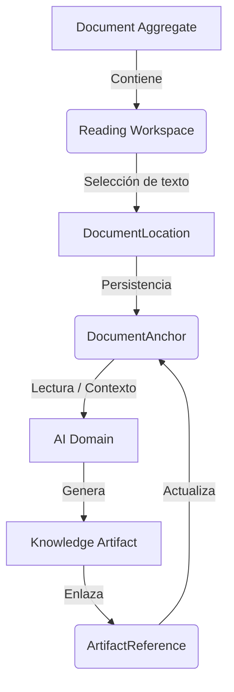

# Ciclo de Vida del DocumentAnchor

El `DocumentAnchor` es la **única entidad permitida** para relacionar un documento con un artefacto de conocimiento derivado (Flashcard, Resumen, Quiz).

El `Document Domain` es el único dueño de las Anclas.

## Pipeline Conceptual

## Reglas Estrictas
1. **Unidireccionalidad:** El documento **no** contiene a la flashcard. El documento contiene un ancla que *referencia* a la flashcard.
2. **Ignorancia del Artefacto:** El `DocumentAnchor` nunca persiste información como `front`, `back`, o `texto_del_resumen`. Solo almacena la referencia opaca (`targetType`, `targetId`).
3. **Ubicación Lógica Fina:** Las anclas apuntan a coordenadas lógicas (`page_index`, `block_id`, `char_start`, `char_end`), nunca al formato original (PDF/PPTX) ni al motor de renderizado.
4. **Ciclo de Vida:**
   - **Creación:** Se crea un ancla "huérfana" cuando el usuario selecciona texto.
   - **Enlace:** Se asocia el `targetId` y `targetType` cuando el AI Domain finaliza la generación del artefacto.
   - **Cascada:** Si el documento base es eliminado, las anclas se eliminan. (Nota: La regeneración de artefactos no borra el ancla, solo puede actualizarla).
