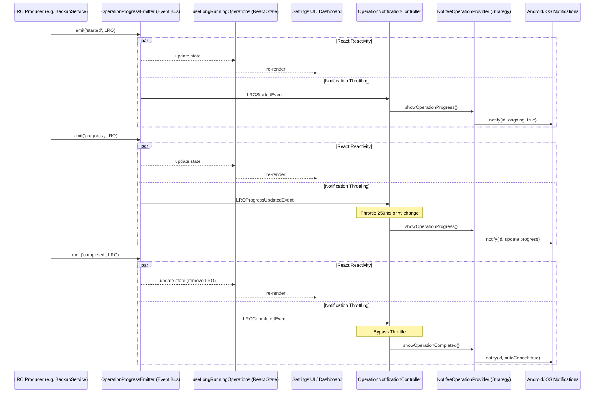

# Long Running Operations (LRO) Platform v1.0

## Objetivo
Centralizar y estandarizar el manejo de operaciones de larga duración (LRO) dentro de Threshold. Cualquier operación que tarde más de 2 segundos en completarse (ej. Backups, Sincronizaciones, Descargas, Importaciones Masivas, Procesamientos de IA) debe enrutarse por esta infraestructura. 

Esto garantiza:
1. Desacoplamiento total entre los servicios de dominio y la capa de presentación (Notificaciones, React State).
2. Prevención de estado duplicado/asíncrono en la UI.
3. Protección contra abuso de la API nativa de notificaciones (throttling automático).
4. Persistencia en la UX a pesar de recargas o paso por background de la aplicación.

## Arquitectura

La arquitectura se fundamenta en el patrón **Publisher-Subscriber** apoyado en un bus global unificado. El dominio de las operaciones LRO está completamente cerrado y no depende de ninguna API externa (como `Notifee` o el framework de notificaciones nativas).



## Componentes Principales

- **`LongRunningOperation` (Modelo):** Entidad inmutable (State) que representa la operación, su tipo, su etapa (`stage`) y el porcentaje de progreso (`progress`).
- **`OperationProgressEmitter` (Event Bus):** Singleton que expone métodos para escuchar y emitir eventos. Guarda en memoria el registro (Map) de las operaciones actualmente en vuelo (vía `getActiveOperations()`).
- **`useLongRunningOperations` (Hook):** Convierte los eventos imperativos del Emitter en estado reactivo consumible por los componentes UI. Elimina la necesidad de declarar `useState` manual en cada pantalla.
- **`OperationNotificationController`:** Responsable de filtrar el volumen de eventos emitidos por el Bus LRO para no sobrecargar el sistema del dispositivo. Aplica throttling de 250 milisegundos para las actualizaciones iterativas, pero deja pasar instantáneamente los estados finales.
- **`NotificationProvider` (Interface):** Contrato que deben implementar los proveedores finales.
- **`NotifeeOperationProvider` (Strategy):** Implementación concreta que traduce los eventos y etapas en configuraciones de canal, iconos y banderas nativas para Android/iOS (ej. `ongoing: true`, `autoCancel: true`).

## Ciclo de vida de una Operación (Eventos)

Las LRO soportan la siguiente máquina de estados lineal:
1. `started`: Registra la operación.
2. `progress`: Actualiza la etapa (`OperationStage`), mensaje, y `percentage`.
3. ESTADOS FINALES MUTUAMENTE EXCLUYENTES:
   - `completed`: Finaliza con éxito (acepta payloads de resultados).
   - `failed`: Finaliza con error.
   - `cancelled`: Terminación prematura controlada.

## Cómo integrar una nueva LRO

Crear una nueva LRO es un proceso netamente declarativo.

```typescript
import { createLRO, OperationType, OperationStage } from '../lro/OperationProgress';
import { operationProgressBus } from '../lro/OperationProgressEmitter';

export const doHeavyWork = async () => {
  // 1. Crear y empezar
  const operation = createLRO(OperationType.Indexing);
  operationProgressBus.emit('started', { operation });
  
  try {
    operation.stage = OperationStage.Preparing;
    operation.progress = { current: 0, total: 100, percentage: 0, indeterminate: true };
    operationProgressBus.emit('progress', { operation });
    
    // ... algoritmo pesado ...
    
    // 2. Reportar progreso
    operation.stage = OperationStage.Processing;
    operation.progress = { current: 50, total: 100, percentage: 50, indeterminate: false };
    operationProgressBus.emit('progress', { operation });
    
    // 3. Completar
    operationProgressBus.emit('completed', { operation, result: { done: true } });
  } catch (error) {
    // 4. Reportar fallo
    operationProgressBus.emit('failed', { operation, error });
  }
};
```

## Checklist para nuevas operaciones

Toda LRO nueva introducida al sistema debe cumplir los siguientes puntos:

- [ ] Crear la operación explícitamente mediante `createLRO()`.
- [ ] Emitir obligatoriamente el evento inicial: `started`.
- [ ] Emitir de forma iterativa el evento: `progress`.
- [ ] Asegurarse de concluir la operación con `completed`, `failed` o `cancelled` (incluso en bloques `catch` / `finally`).
- [ ] No importar la interfaz `NotificationProvider` dentro del servicio productor.
- [ ] No importar la librería `Notifee` (ni `expo-notifications`) dentro del servicio productor.
- [ ] Asegurarse de que los componentes React de la UI consuman el progreso a través del hook `useOperationsByType` (u otros equivalentes del catálogo LRO) y NUNCA llamen a `bus.emit()` por su cuenta.
- [ ] Añadir / actualizar Contract Tests (ej. `ConsumerArchitecture.test.ts`) si aplica.

## Antipatrones y Reglas Permanentes

> [!WARNING]
> **Prohibición Arquitectónica de Notificaciones Directas:**
> Toda operación que tarde > 2 segundos **DEBE** usar LRO.
> Está **estrictamente prohibido** emitir o borrar notificaciones directamente desde servicios de dominio. Los dominios están desacoplados de la capa visual y del sistema del dispositivo. Toda actualización debe fluir unilateralmente a través del `OperationProgressEmitter`.

### Evitar porcentajes falsos
No usar `percentage: 0` -> `percentage: 1` artificialmente si no se conoce la longitud total del progreso. Aprovechar el flag `indeterminate: true` para las etapas "Preparando", "Analizando" o "Verificando". El Controller / UI sabrán traducirlo de forma acorde (ej. spinners infinitos o mensajes estáticos `...`).

### Evitar estados atados al porcentaje
Nunca inferir etapas (`stage`) basado en el valor matemático del progreso (ej. *si es > 50% es Subiendo...*). Modificar manualmente el `stage` en el objeto LRO. Esto permite cambiar los algoritmos internos de los servicios en el futuro sin destruir los textos renderizados.
