# Diagrama Entidad-Relación

```mermaid
graph TD
    %% Usuarios y Acceso
    users[users]
    deleted_users[deleted_users]
    app_visitors[app_visitors]
    two_factor_auth[two_factor_auth]
    feedback_messages[feedback_messages]

    %% Académico
    subjects[subjects]
    courses[courses]
    schedules[schedules]

    %% Evaluaciones y Calificaciones
    assessments[assessments]
    assessment_categories[assessment_categories]
    assessment_results[assessment_results]
    assessment_files[assessment_files]
    grade_history[grade_history]
    subject_grade_snapshots[subject_grade_snapshots]
    grading_systems[grading_systems]
    grading_versions[grading_versions]
    grading_scales[grading_scales]
    grading_periods[grading_periods]
    subject_threshold_overrides[subject_threshold_overrides]

    %% Multimedia
    photos[photos]
    scanned_documents[scanned_documents]
    audio_recordings[audio_recordings]
    audio_transcripts[audio_transcripts]
    youtube_videos[youtube_videos]
    youtube_transcripts[youtube_transcripts]
    gallery_items[gallery_items]

    %% Flashcards
    flashcard_decks[flashcard_decks]
    flashcards[flashcards]
    card_logs[card_logs]
    card_snoozes[card_snoozes]
    card_difficulty_analytics[card_difficulty_analytics]
    review_predictions[review_predictions]
    learning_analytics[learning_analytics]
    study_sessions[study_sessions]

    %% Social
    groups[groups]
    group_memberships[group_memberships]
    shared_decks[shared_decks]
    shared_group_decks[shared_group_decks]

    %% AI
    ai_chats[ai_chats]
    ai_chat_sessions[ai_chat_sessions]
    ai_chat_messages[ai_chat_messages]

    %% Calendario
    calendar_events[calendar_events]

    %% LMS
    lms_accounts[lms_accounts]

    %% Sync
    sync_version[sync_version]
    sync_deletions[sync_deletions]

    %% -------------------------------------------------------
    %% RELACIONES
    %% -------------------------------------------------------

    %% Users → todo
    users -->|"id"| deleted_users
    users -->|"user_id"| subjects
    users -->|"user_id"| courses
    users -->|"user_id"| schedules
    users -->|"user_id"| assessments
    users -->|"user_id"| assessment_results
    users -->|"user_id"| calendar_events
    users -->|"user_id"| grading_periods
    users -->|"user_id"| lms_accounts
    users -->|"user_id"| subject_threshold_overrides
    users -->|"user_id"| photos
    users -->|"user_id"| audio_recordings
    users -->|"user_id"| scanned_documents
    users -->|"user_id"| youtube_videos
    users -->|"user_id"| gallery_items
    users -->|"user_id"| flashcard_decks
    users -->|"user_id"| card_logs
    users -->|"user_id"| learning_analytics
    users -->|"user_id"| review_predictions
    users -->|"user_id"| card_snoozes
    users -->|"user_id"| study_sessions
    users -->|"user_id"| ai_chats
    users -->|"user_id"| ai_chat_sessions
    users -->|"user_id"| group_memberships
    users -->|"creator_user_id"| groups
    users -->|"shared_by_user_id"| shared_decks
    users -->|"shared_to_user_id"| shared_decks
    users -->|"shared_by_user_id"| shared_group_decks
    users -->|"user_id"| two_factor_auth
    users -->|"user_id"| feedback_messages
    users -->|"active_grading_version_id"| grading_versions

    %% Subjects → hijos
    subjects -->|"subject_id"| assessments
    subjects -->|"subject_id"| schedules
    subjects -->|"subject_id"| photos
    subjects -->|"subject_id"| audio_recordings
    subjects -->|"subject_id"| scanned_documents
    subjects -->|"subject_id"| youtube_videos
    subjects -->|"subject_id"| flashcard_decks
    subjects -->|"subject_id"| learning_analytics
    subjects -->|"subject_id"| study_sessions
    subjects -->|"subject_id"| calendar_events
    subjects -->|"subject_id"| ai_chats
    subjects -->|"subject_id"| ai_chat_sessions
    subjects -->|"subject_id"| assessment_categories
    subjects -->|"subject_id"| subject_threshold_overrides

    %% courses → subjects
    courses -->|"course_id"| subjects

    %% Assessments → hijos
    assessments -->|"assessment_id"| assessment_results
    assessments -->|"assessment_id"| assessment_files
    assessment_results -->|"assessment_result_id"| grade_history

    %% Grading chain
    grading_systems -->|"grading_system_id"| grading_versions
    grading_versions -->|"grading_version_id"| grading_scales
    grading_versions -->|"grading_version_id"| assessment_results
    grading_versions -->|"grading_version_id"| subject_grade_snapshots

    %% Assessment categories
    subjects -->|"subject_id"| assessment_categories
    assessments -->|"category_id"| assessment_categories

    %% Flashcard chain
    flashcard_decks -->|"deck_id"| flashcards
    flashcards -->|"card_id"| card_logs
    flashcards -->|"card_id"| card_snoozes
    flashcards -->|"card_id"| card_difficulty_analytics
    flashcards -->|"card_id"| review_predictions
    flashcards -->|"parent_card_id"| flashcards

    %% Deck → Evento
    flashcard_decks -->|"linked_event_id"| calendar_events
    calendar_events -->|"linked_deck_id"| flashcard_decks

    %% Audio/Video → Transcripts
    audio_recordings -->|"recording_id"| audio_transcripts
    youtube_videos -->|"video_id"| youtube_transcripts

    %% Shared decks
    shared_decks -->|"deck_id"| flashcard_decks
    shared_group_decks -->|"deck_id"| flashcard_decks

    %% Groups
    groups -->|"group_pin_id"| group_memberships
    groups -->|"group_pin_id"| shared_group_decks

    %% AI sessions → messages
    ai_chat_sessions -->|"session_id"| ai_chat_messages

    %% Subject → Grade snapshots
    subjects -->|"subject_id"| subject_grade_snapshots
```



## Convenciones de Nomenclatura

- **Tablas**: snake_case, plural (`flashcard_decks`, `assessment_results`)
- **Columnas**: snake_case (`next_review_date`, `sm2_ease_factor`)
- **PK**: `TEXT` (UUID v4) para entidades de negocio; `INTEGER AUTOINCREMENT` para sistema
- **FK**: `{tabla}_id` (ej: `subject_id`, `deck_id`). Si la FK apunta a la misma tabla, se prefiere `parent_{tabla}_id`
- **Timestamps**: `created_at`, `updated_at`, `deleted_at`

## Relaciones con ON DELETE

### Subject → Hijos (CASCADE)
| Relación | ON DELETE |
|----------|-----------|
| Subject → Assessment | NO ACTION (riesgo alto) |
| Subject → Photo | CASCADE |
| Subject → AudioRecording | SET NULL |
| Subject → ScannedDocument | SET NULL |
| Subject → YouTubeVideo | SET NULL |
| Subject → FlashcardDeck | CASCADE |
| Subject → Schedule | NO ACTION (riesgo alto) |
| Subject → StudySession | NO ACTION (riesgo alto) |
| Subject → CalendarEvent | SET NULL |
| Subject → AssessmentCategory | CASCADE |
| Subject → AI Chat / AI Chat Session | CASCADE |
| Subject → LearningAnalytics | CASCADE |
| Subject → ThresholdOverride | CASCADE |
| Subject → GradeSnapshot | CASCADE |

### FlashcardDeck → Hijos (CASCADE)
| Relación | ON DELETE |
|----------|-----------|
| FlashcardDeck → Flashcard | CASCADE |
| FlashcardDeck → SharedDeck | CASCADE |
| Flashcard → CardLog | CASCADE |
| Flashcard → CardSnooze | CASCADE |
| Flashcard → CardDifficultyAnalytics | CASCADE |
| Flashcard → ReviewPrediction | CASCADE |
| Flashcard → Flashcard (parent) | CASCADE (self-ref) |

### Audio/Video → Transcripts (CASCADE)
| Relación | ON DELETE |
|----------|-----------|
| AudioRecording → AudioTranscript | CASCADE |
| YouTubeVideo → YouTubeTranscript | CASCADE |

## Índices Recomendados

```sql
-- Usuarios
CREATE UNIQUE INDEX idx_users_email ON users(email);
CREATE UNIQUE INDEX idx_users_username ON users(username);
CREATE INDEX idx_users_status ON users(status);

-- Materias
CREATE INDEX idx_subjects_user_id ON subjects(user_id);

-- Evaluaciones
CREATE INDEX idx_assessments_subject_id ON assessments(subject_id);
CREATE INDEX idx_assessments_date ON assessments(date);

-- Flashcards
CREATE INDEX idx_flashcards_deck_id ON flashcards(deck_id);
CREATE INDEX idx_flashcards_status ON flashcards(status);
CREATE INDEX idx_flashcards_next_review ON flashcards(next_review_date) WHERE status IN ('new', 'learning');

-- Card Logs
CREATE INDEX idx_card_logs_card_id ON card_logs(card_id);
CREATE INDEX idx_card_logs_user_id ON card_logs(user_id);
CREATE INDEX idx_card_logs_timestamp ON card_logs(timestamp DESC);

-- Sync
CREATE INDEX idx_sync_queue_status ON sync_queue(status);
CREATE INDEX idx_sync_debug_trace ON sync_debug_logs(trace_id);

-- Multimedia
CREATE INDEX idx_photos_subject ON photos(subject_id);
CREATE INDEX idx_audio_subject ON audio_recordings(subject_id);
CREATE INDEX idx_youtube_subject ON youtube_videos(subject_id);
CREATE INDEX idx_documents_subject ON scanned_documents(subject_id);

-- Transcripts
CREATE UNIQUE INDEX idx_audio_transcripts_recording ON audio_transcripts(recording_id);
CREATE UNIQUE INDEX idx_youtube_transcripts_video ON youtube_transcripts(video_id);
```
