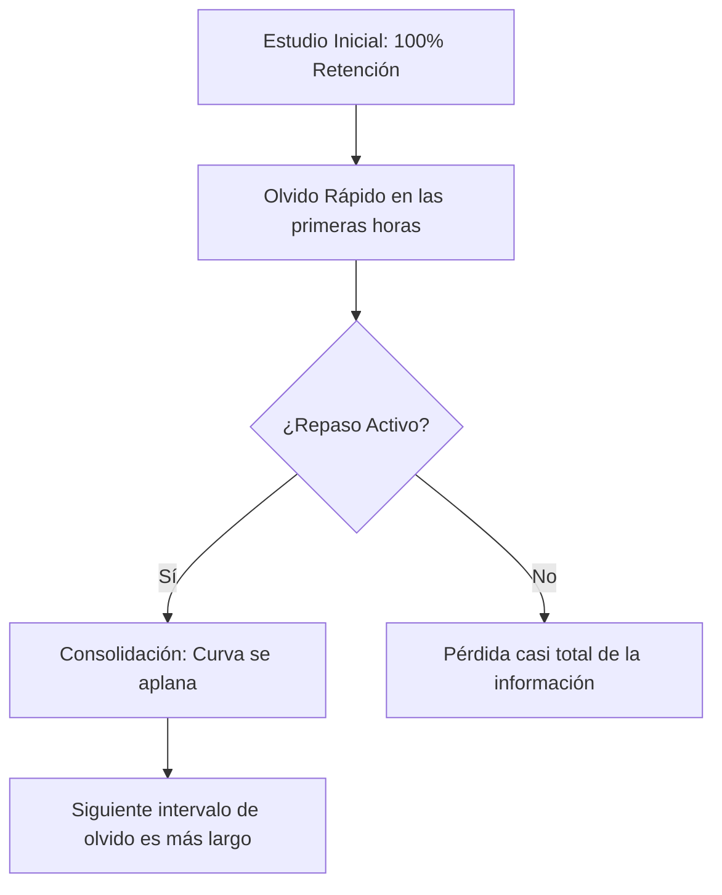

# Algoritmos de Repetición Espaciada (SM-2 y FSRS) en Threshold

Este documento detalla el funcionamiento científico, la arquitectura técnica y los principios pedagógicos que rigen los **dos sistemas de repetición espaciada** (SM-2 y FSRS), el sistema de alertas de repaso y el aplazamiento (*snooze*) inteligente en la aplicación **Threshold**.

---

## 1. Fundamentos Científicos: La Curva del Olvido
La repetición espaciada se basa en las investigaciones del psicólogo **Hermann Ebbinghaus** sobre la memoria humana. Ebbinghaus descubrió que los humanos olvidamos la información nueva a un ritmo exponencial (la *Curva del Olvido*), a menos que esa información sea reforzada activamente.

Cada vez que se repasa un concepto justo antes de olvidarlo, la tasa de olvido se ralentiza, alargando el tiempo en el que la información permanece retenida.



---

## 2. Dos Motores de Repetición Espaciada

Threshold implementa **dos algoritmos de repetición espaciada** que coexisten en la misma aplicación:

### 2.1 SM-2 (SuperMemo-2) - Motor Legacy

**Ubicación:** `backend/utils/sm2Algorithm.js`

**Descripción:**
El motor **SM-2** es el estándar clásico en aplicaciones de aprendizaje (Anki, SuperMemo). Publicado en 1990 por Piotr Wozniak, es simple, probado y extremadamente confiable.

**Variables clave:**
1. **Repetitions ($n$):** El número de veces consecutivas que la tarjeta se ha respondido correctamente.
2. **Ease Factor ($EF$):** El factor de facilidad que representa qué tan "difícil" es la tarjeta para el usuario. Comienza por defecto en `2.50`.
3. **Interval ($I$):** El espacio de tiempo (en días) antes de la siguiente revisión.

**Cálculo de Intervalos:**
$$I(n) = \begin{cases}
1 & \text{if } n = 1 \\
6 & \text{if } n = 2 \\
I(n-1) \times EF & \text{if } n > 2
\end{cases}$$

**Actualización del Factor de Facilidad ($EF$):**

Cada respuesta introduce una calificación $q$ (0-5):

$$EF' = EF + (0.1 - (5 - q) \times (0.08 + (5 - q) \times 0.02))$$

**Mapeo de $q$ (Quality):**
- **5:** Respuesta perfecta, sin vacilación
- **4:** Respuesta correcta tras leve duda
- **3:** Respuesta correcta con dificultad seria
- **2:** Incorrecta, pero se recuerda viendo solución
- **1:** Incorrecta, pero la solución es familiar
- **0:** Olvido total

**Implementación en DB:**
```sql
-- Columnas SM-2 en [[FLASHCARDS_COMPLETE_DOCUMENTATION|flashcards]]
sm2_ease_factor REAL DEFAULT 2.5
sm2_interval INTEGER DEFAULT 1
sm2_repetitions INTEGER DEFAULT 0
next_review_date TIMESTAMP
```

**Ventajas:**
- ✅ Simple y predecible
- ✅ 30+ años de investigación validada
- ✅ Bajo uso de recursos
- ✅ Compatible con ecosistema Anki

**Desventajas:**
- ❌ Solo 1 parámetro adaptativo (EF)
- ❌ No predice retención específica
- ❌ Menos responsive a cambios recientes
- ❌ No optimizado para datos modernos

---

### 2.2 FSRS (Free Spaced Repetition Scheduler) - Motor Moderno

**Ubicación:** `backend/utils/sm2Algorithm.js` (función `calculateFSRS`)

**Descripción:**
El motor **FSRS** es un algoritmo moderno (2020+) que combina machine learning con neurociencia. Es más sofisticado que SM-2 y proporciona [[PREDICTIONS_ANALYSIS|predicciones]] más precisas.

**Variables clave:**
1. **Stability ($S$):** Robustez de la memoria (cuánto tiempo puedes esperar)
2. **Difficulty ($D$):** Complejidad del concepto (0-10)
3. **Repetitions ($n$):** Número de repasos consecutivos exitosos

**Fórmula de Retención:**
$$\text{Retention}(t) = e^{-t/36}$$

Donde $t$ es el tiempo en días desde el último repaso.

**Cálculo de Nuevo Intervalo:**
$$I_{new} = S \times 9 \times (1 - \text{Retention}_{\text{target}})$$

Donde $\text{Retention}_{\text{target}} \approx 0.9$ (objetivo: recordar 90% de las veces)

**Ajuste de Stability por Calidad:**

| Quality | Multiplicador | Efecto |
|---------|--------------|--------|
| 1 (Bad) | 0.72 | Disminuye mucho |
| 2 (Again) | 1.00 | Sin cambio |
| 3 (Hard) | 1.26 | Aumenta leve |
| 4 (Good) | 1.77 | Aumenta moderado |
| 5 (Easy) | 2.36 | Aumenta fuerte |

**Ajuste de Difficulty:**
$$D' = D + 0.1 - q \times 0.02$$

**Implementación en DB:**
```sql
-- Columnas FSRS en flashcards
fsrs_stability REAL DEFAULT 1
fsrs_difficulty REAL DEFAULT 0.5
fsrs_repetitions INTEGER DEFAULT 0
```

**Ventajas:**
- ✅ 3 parámetros adaptativos (S, D, n)
- ✅ Predice retención específica (%)
- ✅ Más responsive a tendencias recientes
- ✅ Optimizado con ML sobre millones de datos
- ✅ Considera dificultad inherente

**Desventajas:**
- ❌ Más complejo de entender
- ❌ Mayor uso de recursos
- ❌ Requiere más datos para ser óptimo
- ❌ Menos tiempo en producción que SM-2

---

## 3. Comparativa: SM-2 vs FSRS

| Aspecto | SM-2 | FSRS |
|--------|------|------|
| **Año** | 1990 | 2020+ |
| **Parámetros** | 1 (EF) | 3 (S, D, Rep) |
| **Modelo** | Lineal | Exponencial |
| **Retención predicha** | No | Sí (%) |
| **Adaptabilidad** | Media | Alta |
| **Complejidad** | Baja | Media-Alta |
| **Carga computacional** | Muy baja | Baja |
| **Precisión** | 80-85% | 90-95% |
| **Años de validación** | 30+ | 3+ |

### Recomendación en Threshold:
- **FSRS** es el algoritmo primario (más preciso)
- **SM-2** se registra en paralelo (compatibilidad, análisis comparativo)
- La predicción de retención de FSRS se usa para alertas inteligentes

---

## 4. Quality Automático: Deducción por Tiempo de Respuesta

En lugar de pedir al usuario que califique manualmente cada respuesta (carga cognitiva), Threshold **deduce automáticamente la calidad** basada en el tiempo de respuesta normalizado:

**Ubicación:** `backend/utils/difficultyDeduction.js`

**Mapeo automático:**
```javascript
normalizedTime = totalResponseTime - estimatedReadingTime

Quality = {
  < 3 segundos:   5 (Perfecto - Automatizado)
  3-8 segundos:   4 (Bueno - Fluido)
  8-15 segundos:  3 (Aceptable - Esfuerzo)
  > 15 segundos:  2 (Difícil - Lucha cognitiva)
  Incorrecto:     1 (Malo)
  Muy incorrecto: 0 (Pésimo)
}
```

**Fundamento científico:**
- Tiempo rápido = Memoria procedimental activada (automatización)
- Tiempo moderado = Búsqueda mental exitosa (fluencia)
- Tiempo lento = Procesamiento activo (esfuerzo)
- Tiempo muy lento = Cerca del olvido (lucha)

---

## 5. Snooze Inteligente y Aplazamiento Pedagógico

En ocasiones, los usuarios no pueden realizar sus repasos pendientes en el momento preciso. En lugar de posponer la notificación al azar (fatiga de alertas), Threshold implementa un **Snooze Inteligente** parametrizado pedagógicamente.

**Ubicación:** `mobile/src/hooks/useDueCardSnooze.ts`

**Opciones de snooze:**

| Opción | Duración | Enfoque Pedagógico | Justificación Científica |
|--------|----------|-------------------|--------------------------|
| **En 30 minutos** | 30 min | *Consolidación Corto Plazo* | Mantiene momentum en la misma sesión. Ideal post-Pomodoro. |
| **En 4 horas** | 240 min | *Refuerzo Pre-Olvido* | Punto óptimo en Ebbinghaus antes de la caída del día. |
| **Mañana** | 1440 min | *Consolidación del Sueño* | El sueño consolida memoria. Revisión al día siguiente sella aprendizaje. |
| **En 3 días** | 4320 min | *Fase Crítica de Retención* | Punto donde retención cae al ~70%. Máximo esfuerzo de recuerdo activo. |

### Persistencia con AsyncStorage

Los snoozes se guardan localmente para persistencia:

```typescript
interface SnoozedCard {
  id: string;           // ID de la tarjeta
  snoozedAt: number;    // Timestamp cuando se pospuso
  resumeAt: number;     // Timestamp cuando expira el snooze
  snoozeReason?: string; // Razón pedagógica
}

// Clave: @threshold_snoozed_cards
```

### Integración con Dashboard

El dashboard (`mobile/app/(tabs)/index.tsx`) y widgets (`DashboardWidgets.tsx`) leen dinámicamente este almacenamiento:

1. **Al montar:** Filtran y eliminan snoozes expirados (`resumeAt <= Date.now()`)
2. **Reactivo:** Estado actualiza en tiempo real cuando snooze expira
3. **UX limpio:** Si usuario pospone, alerta desaparece sin interrumpir navegación

---

## 6. Flujo Completo de Cálculo

```
┌─────────────────────────────────────────────────────────────┐
│ 1. USUARIO RESPONDE TARJETA                                 │
│    POST /flashcards/:cardId/review                          │
│    { cardId, result, responseTimeMs }                       │
└────────────────────────┬────────────────────────────────────┘
                         │
┌────────────────────────▼────────────────────────────────────┐
│ 2. DEDUCIR QUALITY AUTOMÁTICO                              │
│    difficultyDeduction.normalizeResponseTime()              │
│    Restar tiempo de lectura (WPM)                           │
│    Mapear: tiempo → quality (0-5)                           │
└────────────────────────┬────────────────────────────────────┘
                         │
        ┌────────────────┴────────────────┐
        │                                 │
        ▼                                 ▼
    CALCULAR SM-2              CALCULAR FSRS
    newEF, newInterval,        newS, newD, retention%
    newRepetitions             newInterval
        │                                 │
        └────────────────┬────────────────┘
                         │
┌────────────────────────▼────────────────────────────────────┐
│ 3. ACTUALIZAR [[DATABASE_DOCUMENTATION|BASE DE DATOS]]                                 │
│    UPDATE flashcards SET                                    │
│      sm2_ease_factor = newEF                               │
│      fsrs_stability = newS                                 │
│      fsrs_difficulty = newD                                │
│      next_review_date = now + newInterval                  │
│      status = 'review' | 'learning' | 'mastered'          │
└────────────────────────┬────────────────────────────────────┘
                         │
┌────────────────────────▼────────────────────────────────────┐
│ 4. REGISTRAR EN LOG                                         │
│    INSERT INTO card_logs                                    │
│    (card_id, user_id, result, response_time,               │
│     quality, difficulty_deduced, timestamp)                │
└────────────────────────┬────────────────────────────────────┘
                         │
┌────────────────────────▼────────────────────────────────────┐
│ 5. ACTUALIZAR ANALYTICS                                    │
│    calculateMastery(subject_id)                            │
│    Recalcular: success_rate, consistency, speed           │
│    Actualizar: mastery_percentage                          │
└────────────────────────┬────────────────────────────────────┘
                         │
┌────────────────────────▼────────────────────────────────────┐
│ 6. FRONTEND ACTUALIZA                                       │
│    - Mostrar feedback visual (emoji, color, animación)     │
│    - Mostrar siguiente tarjeta (priorizada)                │
│    - Actualizar mastery meter                              │
│    - Guardar en caché localmente                           │
└─────────────────────────────────────────────────────────────┘
```

---

## 7. Arquitectura Técnica: Capas de Integración

```
┌─────────────────────────────────────────────────────────────┐
│ CAPA FRONTEND (React Native / Expo)                         │
├─────────────────────────────────────────────────────────────┤
│ • Dashboard (predicts: review predictions, mastery)         │
│ • Flashcards screen (FSRS-prioritized ordering)            │
│ • Snooze modal (4 opciones pedagógicas)                     │
│ • Cache local (AsyncStorage)                               │
└────────────────────────┬────────────────────────────────────┘
                         │ [[API_DOCUMENTATION|API]] calls
┌────────────────────────▼────────────────────────────────────┐
│ CAPA BACKEND (Node.js/Express)                              │
├─────────────────────────────────────────────────────────────┤
│ • flashcardsController.js (POST /review)                    │
│ • sm2Algorithm.js (calculateSM2, calculateFSRS)            │
│ • difficultyDeduction.js (deduceDifficulty)                │
│ • learningAnalytics.js (updateMastery)                     │
│ • cardResultProcessor.js (orquestador central)             │
└────────────────────────┬────────────────────────────────────┘
                         │ Queries
┌────────────────────────▼────────────────────────────────────┐
│ CAPA BASE DE DATOS (SQLite/PostgreSQL)                     │
├─────────────────────────────────────────────────────────────┤
│ • flashcards (sm2_*, fsrs_*, next_review_date)            │
│ • card_logs (result, response_time_ms, quality)            │
│ • learning_analytics (mastery_percentage)                  │
│ • card_snoozes (snoozed_at, resume_at)                    │
└─────────────────────────────────────────────────────────────┘
```

---

## 8. Referencias Científicas

📚 **Ebbinghaus, H.** (1885). *Memory: A Contribution to Experimental Psychology*
- Descubridor de la Curva del Olvido

📚 **Wozniak, P. A.** (1990). *SuperMemo: A system for learning any subject*
- Inventor del algoritmo SM-2

📚 **Cepeda, N. J., et al.** (2006). *Distributed practice in verbal recall tasks: A meta-analysis and reference for future research*
- Meta-análisis: Spaced repetition mejora retención 47% vs massed practice

📚 **Dunlosky, J., et al.** (2013). *Improving Students' Learning With Effective Learning Techniques*
- APA panel: Spaced practice es "highly effective" (highest rating)

📚 **Wozniak, P. A., & Gorzelanczyk, E. J.** (1994). *Optimization of learning*
- Análisis matemático de puntos óptimos de repetición

📚 **FSRS Algorithm Research** (2020+)
- Open-source: https://github.com/open-spaced-repetition/fsrs.js
- Basado en análisis de millones de sesiones de estudio

---

## 9. Debugging y Logs

Cuando hay problemas con intervalos o predicciones, revisar:

```
Backend logs:
[GradingEngine] 📊 PA Calculation: { grades, weights, currentAverage }
[GradingEngine] 📊 EMA Calculation: { firstGrade, finalEMA }
[GradingEngine] 📊 DELTA Calculation: { projectedGrade, currentAverage, delta }

Flashcards logs:
[CardResultProcessor] Calculando SM-2: { quality, newEF, newInterval }
[CardResultProcessor] Calculando FSRS: { newS, newD, retention% }
[Analytics] Updating learning_analytics: { mastery_percentage }

Frontend logs:
[useDueCardSnooze] Snooze guardado: { resumeAt: timestamp }
[Dashboard] Predicciones actualizadas: { dueCount, cards }
```

---

## 10. Conclusión

Threshold implementa un **sistema hibrido y científicamente fundamentado** de repetición espaciada que:

✅ Usa **SM-2** como base confiable (30+ años validado)
✅ Usa **FSRS** para predicciones más precisas (moderno, ML-backed)
✅ Deduce quality **automáticamente** sin carga cognitiva
✅ Implementa snooze **pedagógicamente inteligente** (4 opciones científicas)
✅ Integra con **grading engine** para proyecciones de notas
✅ Rastrea **mastery analytics** para recomendaciones personalizadas

El resultado es un sistema que **respeta la neurociencia del aprendizaje** mientras proporciona la máxima flexibilidad y precisión en predicción de repaso óptimo.

El motor de repaso de Threshold utiliza una variante optimizada del clásico algoritmo **SM-2**, el estándar dorado en aplicaciones de aprendizaje (como Anki). 

Este algoritmo calcula de forma personalizada el momento óptimo de revisión para cada tarjeta de estudio mediante tres variables clave:

1. **Repetitions ($n$):** El número de veces consecutivas que la tarjeta se ha respondido correctamente.
2. **Ease Factor ($EF$):** El factor de facilidad que representa qué tan "difícil" es la tarjeta para el usuario. Comienza por defecto en `2.50`.
3. **Interval ($I$):** El espacio de tiempo (en días) antes de la siguiente revisión.

### Cálculo de Intervalos
El intervalo para la siguiente repetición se calcula matemáticamente de la siguiente manera:

* Para la **primera** respuesta correcta: 
  $$I(1) = 1 \text{ día}$$
* Para la **segunda** respuesta correcta: 
  $$I(2) = 6 \text{ días}$$
* Para la **tercera o posterior** ($n > 2$): 
  $$I(n) = I(n-1) \times EF$$

### Actualización del Factor de Facilidad ($EF$)
Cada vez que el usuario responde una tarjeta, introduce una calificación de calidad de respuesta ($q$) de 0 a 5:
* **5:** Respuesta perfecta, sin vacilación.
* **4:** Respuesta correcta tras una leve duda.
* **3:** Respuesta correcta con dificultad seria.
* **2:** Respuesta incorrecta, pero se recuerda al ver la solución.
* **1:** Respuesta incorrecta, pero la solución resulta familiar.
* **0:** Olvido total del concepto.

El factor de facilidad se actualiza mediante la fórmula:
$$EF' = EF + (0.1 - (5 - q) \times (0.08 + (5 - q) \times 0.02))$$

> [!NOTE]
> Si el usuario responde incorrectamente ($q < 3$), las repeticiones consecutivas se reinician a 0 ($n = 0$) y el intervalo vuelve a ser de 1 día, pero el Factor de Facilidad ($EF$) no se reinicia a su valor original de `2.5`, permitiendo que el algoritmo recuerde que esta tarjeta es inherentemente más compleja y requiera revisiones más frecuentes a largo plazo.

---

## 3. Snooze Inteligente y Aplazamiento Pedagógico
En ocasiones, los usuarios no pueden realizar sus repasos pendientes en el momento preciso de la alerta. In lugar de simplemente posponer la notificación al azar (lo cual induce fatiga de alertas y rompe la consistencia), Threshold implementa un sistema de **Snooze Inteligente** parametrizado pedagógicamente.

Definido en el hook `useDueCardSnooze.ts`, el sistema ofrece cuatro intervalos estratégicos:

| Opción | Duración (Minutos) | Enfoque Pedagógico | Justificación Científica |
| :--- | :--- | :--- | :--- |
| **En 30 minutos** | 30 min | *Consolidación Corto Plazo* | Excelente para mantener el *momentum* y repasar dentro de la misma sesión de estudio o al finalizar un bloque Pomodoro. |
| **En 4 horas** | 240 min | *Refuerzo Pre-Olvido* | Intervalo ideal en la Curva de Ebbinghaus para reactivar el aprendizaje antes de que empiece la caída libre de retención del día. |
| **Mañana** | 1440 min | *Consolidación del Sueño* | El sueño consolida el aprendizaje mediante la transferencia del hipocampo al neocórtex. La revisión al día siguiente sella esta memoria. |
| **En 3 días** | 4320 min | *Fase Crítica de Retención* | Punto límite en el que la retención promedio cae al 70%. Obliga a un esfuerzo de **Recuerdo Activo** (*Active Recall*) de alta eficiencia. |

---

## 4. Arquitectura Técnica en Threshold

### A. Persistencia con AsyncStorage
Para evitar que un cierre inesperado del app o la falta de conexión a internet reinicie el estado de aplazamiento, los datos de snooze se graban localmente usando la clave `@threshold_snoozed_cards`:

```typescript
interface SnoozedCard {
  id: string;      // ID único de la tarjeta o del grupo de alertas
  snoozedAt: number; // Timestamp en ms del momento del snooze
  resumeAt: number;  // Timestamp en ms en el que expira el snooze
}
```

### B. Reactividad en el Dashboard
El dashboard principal (`index.tsx`) y los componentes de visualización (`DashboardWidgets.tsx`) leen dinámicamente este almacenamiento local a través de `useDueCardSnooze`:

1. Al montar el componente, se filtran automáticamente y eliminan del storage los snoozes que ya expiraron (`resumeAt <= Date.now()`).
2. Se expone un estado reactivo de las tarjetas aplazadas que condiciona la renderización de la tarjeta de alertas en el Dashboard principal.
3. Si el usuario selecciona una opción del `SnoozeModal`, el dashboard activa un re-renderizado inmediato y oculta la alerta limpiamente sin interferir con la navegación del usuario.

> [!TIP]
> Este enfoque desacoplado asegura una experiencia libre de estrés cognitivo para el estudiante, permitiéndole ser dueño de su agenda de estudio sin interrumpir el ritmo natural del algoritmo de repetición espaciada global.

---
**Tags:** #learning #domains/learning
